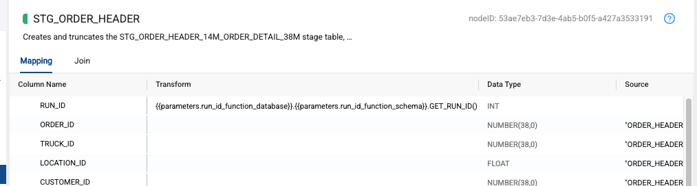

# Coalesce Run ID Function

This repository contains a Snowflake SQL function that extracts the Coalesce run ID from query tags in the current session. This is particularly useful for tracking and debugging Coalesce-initiated queries in Snowflake and getting the Run ID during job execution.

## Function Definition

```sql
CREATE OR REPLACE FUNCTION <YOUR DATABASE>.<YOUR SCHEMA>.GET_RUN_ID()
RETURNS NUMBER(38,0)
LANGUAGE SQL
AS 'SELECT COALESCE((
    SELECT TO_OBJECT(TO_VARIANT(query_tag)):"coalesce"."runID"::number
    FROM TABLE(INFORMATION_SCHEMA.QUERY_HISTORY())
    WHERE SESSION_ID = CURRENT_SESSION()
    AND query_tag Like ''%coalesce%''
    ORDER BY END_TIME DESC
    LIMIT 1
), -2) AS RUN_ID';
```

## Description

The `GET_RUN_ID()` function performs the following operations:

1. **Query History Access**: 
   - Queries the `INFORMATION_SCHEMA.QUERY_HISTORY()` table function
   - Filters for the current session using `CURRENT_SESSION()`

2. **Tag Filtering**:
   - Looks for query tags containing 'coalesce'
   - Orders by `END_TIME DESC` to get the most recent query
   - Limits to 1 result

3. **JSON Parsing**:
   - Converts query tag to a variant using `TO_VARIANT`
   - Parses the JSON structure using `TO_OBJECT`
   - Extracts the runID from the coalesce object path

4. **Default Handling**:
   - Returns -2 if no valid run ID is found - this is what you will see in a Workspace execution
   - Converts the result to NUMBER(38,0)

## Query Tag Format

The function expects query tags in the following JSON format:
```json
{
  "coalesce": {
    "runID": 123456,
    "other_fields": "..."
  }
}
```

## Return Values

- **Positive Number**: Valid Coalesce run ID
- **-2**: No Coalesce run ID found in current session

## Dependencies

- Requires access to `INFORMATION_SCHEMA.QUERY_HISTORY()`
- Needs permission to read query tags
- Session must be active

## Implementation Examples

### Workspace Configuration



The workspace parameters should be configured with:
```json
{
    "run_id_function_database": "<YOUR DATABASE>",
    "run_id_function_schema": "<YOUR SCHEMA>"
}
```

### Node Implementation


In your node mappings, configure the RUN_ID field using:
```sql
((parameters.run_id_function_database)).((parameters.run_id_function_schema)).GET_RUN_ID()
```

This will automatically pull the run ID from the current Coalesce execution context. The RUN_ID field is typically configured as an INT data type and can be used to track the execution across different nodes and operations.

## Directory Structure

```
coalesce_run_id_function/
├── README.md
├── images/
│   ├── workspace_parameters.png
│   └── node_mapping.png
```

